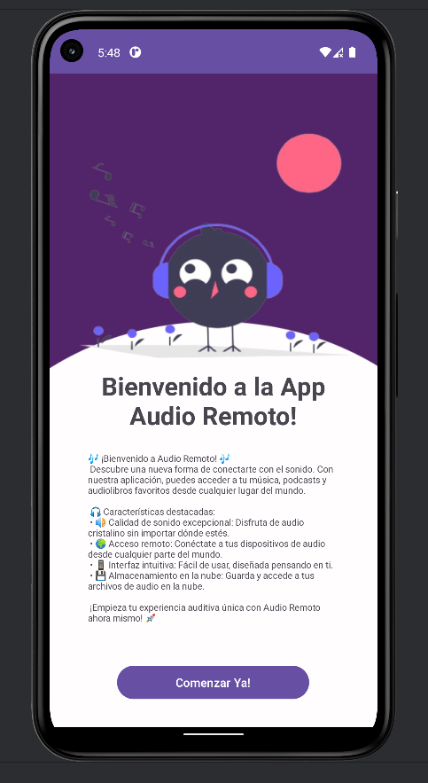
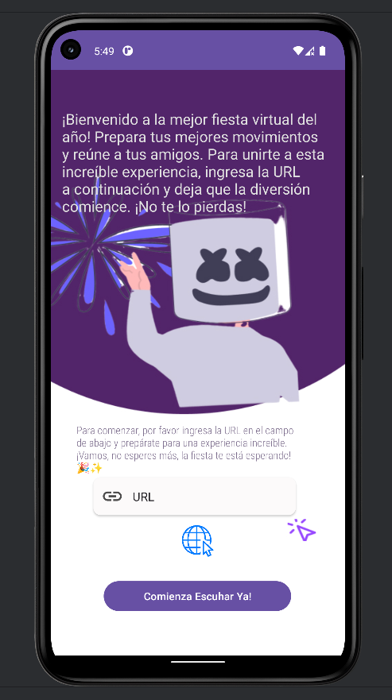
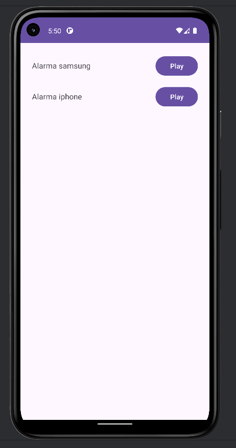

# University team project - Remote audio playback

This project consists of playing audio in the app and having it remotely hosted on a web page or hosting.

## User home page

  

## Page where you can insert the URL

  

## Once clicked on the button to access the URL

As you can see, I passed a test link where I hosted 2 audios.
Now the user can press the play button to start playback.

  

